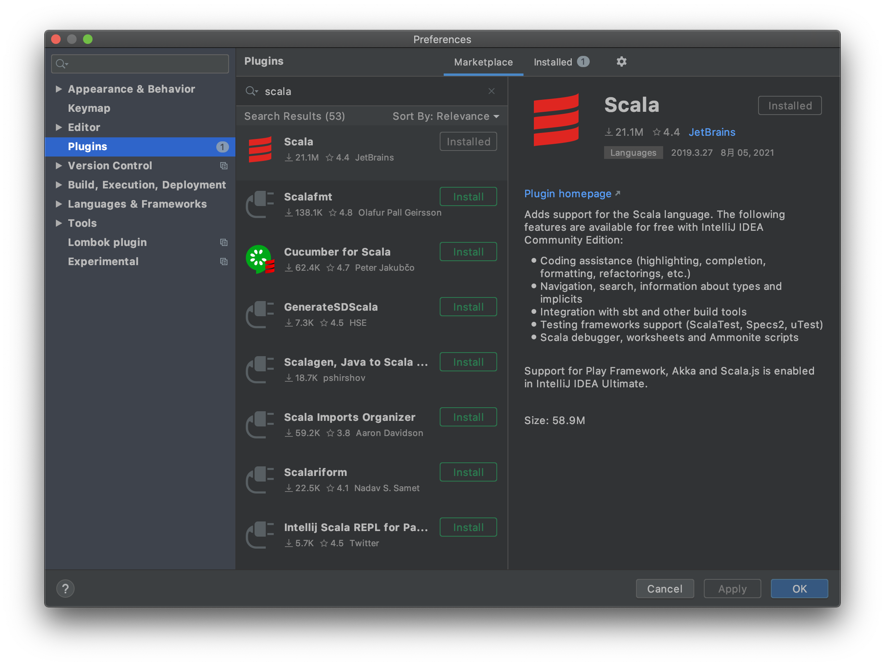
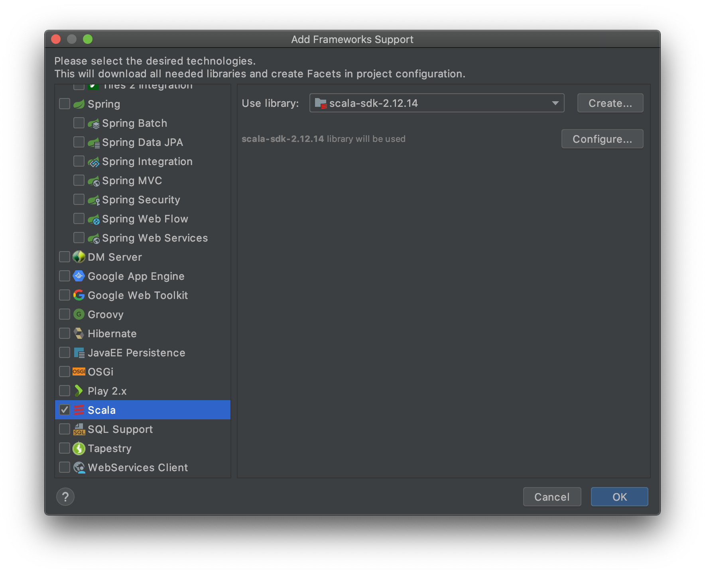
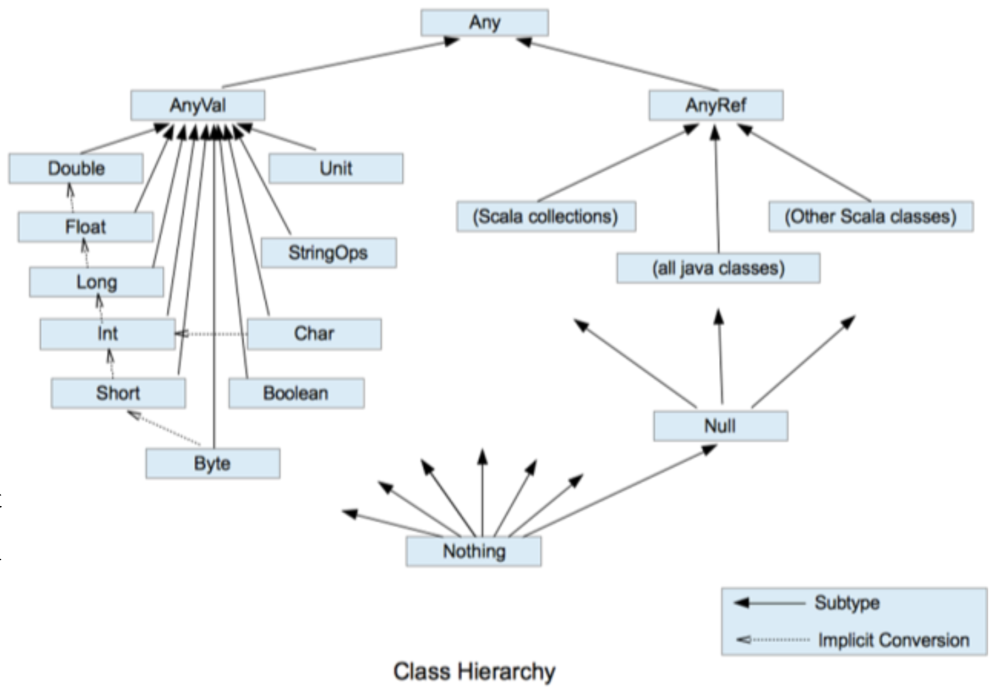

> 本系列文章会着重介绍Scala与Java的不同点，较适合学习过Java的人阅读。
> 
> 本篇文章介绍了Scala的编程环境，变量和数据类型。

### 引言

作为一个大数据入门者，需要知道Spark是当今很流行的一个计算框架，Spark底层是由Scala编写的，掌握Scala有助于更好的通过阅读源码去学习Spark框架，因此Scala很有学习的必要。


### Scala和Java的关系

Scala是基于Java的一门结合**面向对象**和**函数式编程**两大特性的静态语言，相比Java表达性更强。

Java通过javac编译器编译生成字节码.class文件；Scala通过scalac编译器编译生成字节码.class文件；生成的.class都可以在跨平台的jvm虚拟机上运行。

Scala可以直接调用Java的部分类库，也有自己的一些类库，更加丰富。


### Scala环境搭建

首先进入Spark官网发现最新版本的Spark 3.1.2是用Scala 2.12写的，因此我们也在Scala官网中找到Scala 2.12对应的安装包，我们的系统是MacOS所以选择下载对应版本的tar.gz文件，下载后解压到/usr/local路径下，配置环境变量如下，并编译。

```bash
export SCALA_HOME="/usr/local/scala-2.12.14"
export PATH=$PATH:$SCALA_HOME/bin
```

写HelloScala程序如下：

```scala
object HelloScala {
    def main(args: Array[String]): Unit = {
        println("hello scala")
    }
}
```

scalac进行编译，生成了两个.class文件

```bash
$ scalac HelloScala.scala
$ ls
HelloScala$.class HelloScala.class  HelloScala.scala
```

这里讲一个和Java的不同，Java是在jvm启动时，直接去找static的，参数为String数组的main方法；然而这个逻辑其实没有那么的面对对象，Scala将面对对象做得更加彻底，程序中的HelloScala实则为HelloScala$的一个单例静态对象，程序运行时将执行该静态对象的main方法，后面会通过具体例子进行解析。


### 第一个IDEA中的Scala程序（MacOS）

1. maven创建一个新工程。

2. 在Preferences中选中Plugins，搜索并安装Scala插件，安装后要重启IDEA。

3. 当前Maven在new新建文件时发现并没有Scala.class的选项，需要引入Scala框架，右键左侧项目目录的项目名，点击Add Framework Support，选择Scala，右侧User libary需要选择你的 Scala 安装目录，然后会自动识别到Scala sdk，确认后就可以new一个Scala.class了。
   

4. 新建一个Scala类Student.scala

   ```Scala
   class Student(name: String, age: Int)  {
     def printInfo(): Unit = {
       println(name + " " + age + "   " + Student.school)
     }
   }
   
   // 伴生对象
   object Student{
     val school: String = "uuu"
   
     def main(args: Array[String]): Unit = {
       val alice = new Student("Alice", 20)
       val bob = new Student("Bob", 23)
       alice.printInfo()
       bob.printInfo()
      }
   }
   ```

   编译后同样生成Student.class和Student$.class两个字节码文件，Student.class同Java的类，可以实例化成不同的对象。程序中Object声明了一个伴生对象，这个伴生对象实际上是Student$.class中的MODULE$对象，是一个全局只有一份的静态对象，MODULE$对象的所属类是Student$.class，下面我们用JD-GUI反编译这两个字节码文件：

Student$.class：

   ```Java
   public final class Student$ {
     public static Student$ MODULE$;
     
     private final String school;
     
     public String school() {
       return this.school;
     }
     
     public void main(String[] args) {
       Student alice = new Student("Alice", 20);
       Student bob = new Student("Bob", 23);
       alice.printInfo();
       bob.printInfo();
     }
     
     private Student$() {
       MODULE$ = this;
       this.school = "uuu";
     }
   }
   ```

Student.class：


   ```Java
   public class Student {
     private final String name;
     
     private final int age;
    
     public Student(String name, int age) {}
     
     public void printInfo() {
       Predef$.MODULE$.println((new StringBuilder(4)).append(this.name).append(" ").append(this.age).append("   ").append(Student$.MODULE$.school()).toString());
     }
     
     public static void main(String[] paramArrayOfString) {
       Student$.MODULE$.main(paramArrayOfString);
     }
     
     public static String school() {
       return Student$.MODULE$.school();
     }
   }
   ```

   这里反编译Student$.class的结果可能稍微有一点点问题，网上进行查阅后发现应该是有一个静态代码块去创建一个全局唯一的Student$对象并赋值到MODULE$，我们就暂且当作已经有了这个全局对象；正是因为有这个对象的存在，才可以取代Java对变量和方法的static关键字修饰，真正的做到面向对象。原Java中的静态内容都放在这个伴生对象中，这些“静态”内容有了真正所属的伴生对象，因此我们也看到了Student$类有“静态”属性school和“静态”的main函数，伴生类Student.class仍然是程序入口，它可以访问伴生对象的所有变量和方法，在Student.class反编译的代码中也能看到它有了school和main方法，方法体中实则都是去调用Student$中伴生对象MODULE$的变量和方法。


### Scala基础

**变量与常量**

变量用var修饰，常量用val修饰。

能用常量的地方不用变量（函数式编程思想）

```Scala
object Test_Variable {
  def main(args: Array[String]): Unit = {
    var a: Int = 10
    // 声明变量时类型可以省略
    var a1 = 10
    val b1 = 16

    // 类型确定就不能修改
    // a1 = "uuu"

    // 变量声明必须有初始值
    // var a2

    // val修饰常量无法修改
    // b1 = 20

    val alice = new Student("alice", 20)
    alice.age = 23
    alice.printInfo()
  }
}
```

将16赋值给b1后会被编译器判别为Int类型，由于val修饰了b1为常量，对b1的值进行修改会报错；val修饰的对象，其中的属性可以改变，但不可以去重新new指向新的地址，集合同理。这里发现上面代码中获取alice的age时报错，原因是之前Student类中并没有声明age属于该类，回顾Student类的写法：

```Scala
class Student(name: String, age: Int)  {...}
```

它的含义是将name和age作为构造函数的形参传入，需要在age前加var或val声明为成员变量或成员常量，成员变量可以对alice.age赋其它值进行改变，常量则不可以。修改后的Student类编译生成的字节码文件反编译如下，发现多了访问和修改age的方法。

```Java
public class Student {
  private final String name;
  
  private int age;
  
  public int age() {
    return this.age;
  }
  
  public void age_$eq(int x$1) {
    this.age = x$1;
  }
  
  public Student(String name, int age) {}
  
  public void printInfo() {
    Predef$.MODULE$.println((new StringBuilder(4)).append(this.name).append(" ").append(age()).append("   ").append(Student$.MODULE$.school()).toString());
  }
  
  public static void main(String[] paramArrayOfString) {
    Student$.MODULE$.main(paramArrayOfString);
  }
  
  public static String school() {
    return Student$.MODULE$.school();
  }
}

```


**字符串**

Scala字符串输出有三种方式

- 类似Java用加号做字符串拼接
- 类似C语言printf，用%作变量的占位（%s%d等）
- 类似Shell脚本进行插值通过$取变量值

```Scala
object Test_String {
  def main(args: Array[String]): Unit = {
    val name: String = "aaron"
    val age: Int = 22
    println(name + "今年" + age + "岁")

    // 1. 字符串复制多次并拼接（类Java）
    println(name * 3)

    // 2. printf (类C)
    printf("%s今年%d岁\n", name, age)

    // 3. 字符串模版 (类Shell)
    println(s"${name}今年${age}岁")

    val num1: Float = 2.3456f
    val num: Double = 2.3456
    println(num1)
    println(f"The num is ${num}%.2f")  // f""可做格式化

    // 三引号
    println(s"""
         |select *
         |  from
         |  student
         |where
         |  name = ${name}
         |and
         |  age = 12
         |""".stripMargin)
  }
}


--------  Output  --------
aaron今年22岁
aaronaaronaaron
aaron今年22岁
aaron今年22岁
2.3456
The num is 2.35

select *
  from
  student
where
  name = aaron
and
  age = 12
```

**数据类型**

下面会介绍一下数据类型和Java的不同之处




Scala是完全面向对象的，因此没有了之前Java中int、float等基本类型，上图为Scala中所有数据类型的一个类层级图。

整数、浮点数、布尔类型、字符都与Java类似，不另外介绍了。下面说一下Scala比较独特的**空类型**。空类型分为三种：

- **Unit：**Unit取代的其它语言中的void，void只是一个空值关键字，二Unit作为一个空值对象更加体现了面向对象的思想，Unit只有一个实例值，通过输出可以看到该值输出为()。
- **Null：**空引用的类型，只有一个实例值null。
- **Nothing：**在Scala类层级最底端，是所有类型的子类型。通常在确定一个方法会返回异常的时候，将返回值类型标志为Nothing。

```scala
def m1(n: Int): Int = {
	if (n == 0)
  	throw new NullPointerException
  else
    return n
}

def m2(n: Int): Nothing = {
  throw new NullPointerException
}
val d1 = m1(4)
println("d1:" + d1.getClass.getSimpleName) // 输出常量类型
val d2 = m1(0)
println("d2:" + d2.getClass.getSimpleName)


--------  Output  --------
d1:int
Exception in thread "main" java.lang.NullPointerException
	at chapter02.Test07_DataType$.m2$1(Test07_DataType.scala:45)
	at chapter02.Test07_DataType$.main(Test07_DataType.scala:55)
	at chapter02.Test07_DataType.main(Test07_DataType.scala)

```

如在m1中，不是只返回异常，Int不会向Nothing做类型转换，因此返回类型需要写该方法可能返回的最高级别的类型，该例子中就是Int。


**类型转换：**

(1) 自动提升原则: 有多种类型的数据混合运算时，系统首先自动将**所有数据转换成精度大的那种数据类型**，然后再进行计算。Byte和Short类型之间的计算也会自动转换成Int类型。

(2) 把精度大的数值类型赋值给精度小的数值类型时，就会报错，反之就会进行自动类型转换。高精度转低精度需要用toByte、toInt等方法进行强制转换。

(3) (byte，short)和 char 之间不会相互自动转换，要转换也需要toByte、toChar进行强制转换。

(4) byte，short，char 他们三者可以计算，在计算时首先转换为 int 类型。

(5) 浮点数向下转为整数时精度丢失，取整只保留整数部分，不四舍五入。

(6) 数值类型和String类型相互转换：

```Scala
// (1) 数值转String
val n: Int = 27
val s: String = n + ""
// val s: String = n.toString
println(s)
// (2) String转数值
val m: Int = s.toInt
val f: Float = "12.3".toFloat
val f2: Int = "12.3".toFloat.toInt // 不能直接强转Int
println(f2)


--------  Output  --------
27
12
```


