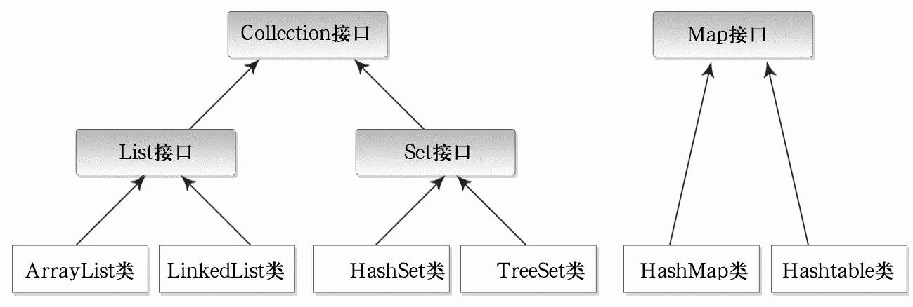
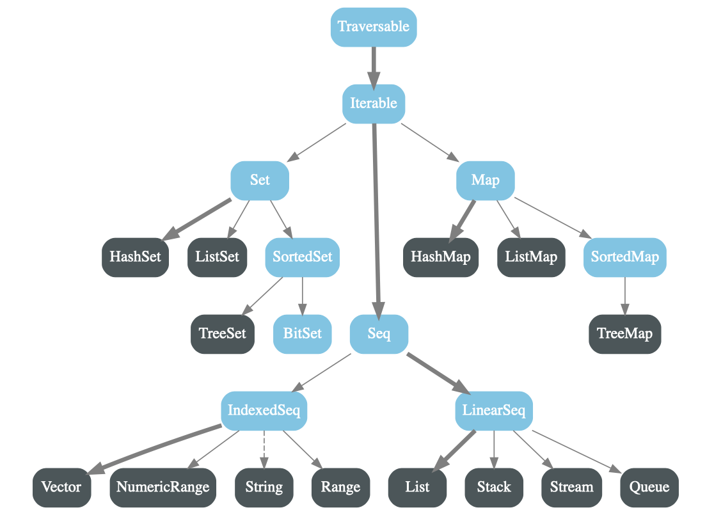
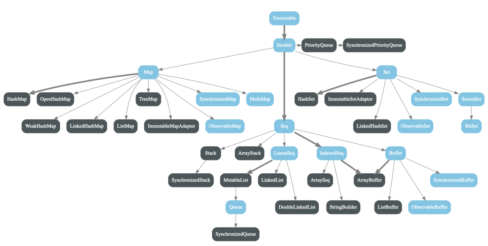

> 本系列文章会着重介绍Scala与Java的不同点，较适合学习过Java的人阅读。
> 
> 本篇文章介绍了Scala的的第一大集合类型 —— 序列。

## Scala —— 数组、列表

首先回顾Java集合框架图：



Java集合有三大类型List、Set、Map，从图中可以发现类型系统设计并不统一，Map和其它两者进行转换也比较复杂；Scala在该方面进行了改进，Scala中集合也对应的分三种类型：序列（Seq）、集（Set）、映射（Map），所有集合统一的扩展自**Iterable特质**。

Scala为大多数集合类提供了可变和不可变版本，大体思想和Java中的不可变String和可变StringBuilder类似，对String修改会new一个新的String对象，StringBuilder则是在原对象中直接修改；但是String底层实现是一个声明private的char类型数组，对外访问不到，所说的不可变是每一位都不可变，但不可变集合指的是**引用的不可变**，即集合的数据类型、大小不可变，集合中每一个元素可以修改。

- 不可变集合:scala.collection.**immutable** 
- 可变集合: scala.collection.**mutable**

Scala不可变集合框架图：




Scala可变集合框架图：



蓝色图标为特质，黑色为实现类，实线为直接向箭头指向的集合类引入特质，虚线（不可变集合的String）为通过隐式转换和Scala中的集合类型产生一定联系。隐式转换定义在Predef.scala中，Predef.scala是默认导入的三个包之一，String会被隐式转换为引入了IndexedSeq特质的WrappedString类，从而和IndexedSeq产生联系，隐式转换也会在后面再单独拿出来做讲解。


### 数组

1）不可变数组

上面Scala官网给出的集合框架图少了不可变Array，不可变的Array和String一样都是通过隐式转换和IndexedSeq相关联。

创建数组：

第一种方法类似Java去new：val arr: Array[Int] = new Array[Int] (5)

第二种方法用到了Array伴生对象中写有的apply方法，在 [Scala入门学习（四）： 面向对象 ](https://zhuanlan.zhihu.com/p/399419869)中进行过介绍，调用apply去new一个伴生类实例对象可以省略apply，直接写类名，然后括号内加apply方法的参数即可。

Array伴生对象中的apply方法（其中之一）：

```Scala
/** Creates an array of `Int` objects */
  // Subject to a compiler optimization in Cleanup, see above.
  def apply(x: Int, xs: Int*): Array[Int] = {
    val array = new Array[Int](xs.length + 1)
    array(0) = x
    var i = 1
    for (x <- xs.iterator) { array(i) = x; i += 1 }
    array
  }
```

xs为可变参数，对每种数据类型都提供了对应的apply方法，apply方法至少应该有一个参数x，方法体中会用传入的参数new一个Int类型的Array。

```Scala
// 方法一
val arr: Array[Int] = new Array[Int] (5)

// 方法二
val arr1 = Array(1, 2, 3)
println(arr1.getClass.getSimpleName)
```


访问和修改数组：

访问Array中元素用 arr(0)，修改对 arr(0) 直接赋值即可，这里实际上是调用了Array的apply方法，写的时候省略apply，这个apply不是在Array的伴生对象中，而是在Array类中，且方法体是在运行时编译器自动填入的，如下：

```Scala
final class Array[T](_length: Int) extends java.io.Serializable with java.lang.Cloneable {

  def length: Int = throw new Error()

  def apply(i: Int): T = throw new Error()

  def update(i: Int, x: T) { throw new Error() }

  override def clone(): Array[T] = throw new Error()
}

```


遍历数组：

- 范围遍历集合的下标 0 到 length，通过下标访问元素并输出。
- 使用引入特质SeqLike的indices方法，直接返回下标的Range集合。
- 下标集合中取下标再利用下标访问替换为直接从集合中取元素并访问。
- 用迭代器访问。
- 使用引入特质IndexedSeqOptimized的foreach方法，参数为匿名函数，声明要执行的操作。
- 使用引入特质Traversable的mkString方法将集合转化为字符串，需要传参集合中每个元素分开的分隔符。

```Scala
// 方法一
for (i <- 0 until arr1.length) println(arr1(i))

// 方法二
for (i <- arr1.indices) println(arr1(i))

// 方法三
for (elem <- arr1) println(elem)

// 方法四
val iter = arr1.iterator
while (iter.hasNext) println(iter.next())

// 方法五
arr1.foreach((elem: Int) => println(elem))
arr1.foreach( println )

// 方法六
println(arr1.mkString("--"))
```


添加元素：

不可变对象添加元素是在数组基础上添加元素后返回新数组，调用ArrayOps的 +: 和 :+ 方法，前者在前面添加元素，后者在后面添加元素。Scala调用函数可以省略“点”，需要注意，调用 +: 和 :+ 方法时省略“点”，冒号那一侧是数组，加号那一侧是添加的元素，调用时新元素在左面则新数组中新元素就在最前面，新元素在右面则相反；也分享一个记忆小窍门，冒号在python中可代表全部选择，全部选择的自然就是集合。

```scala
val arr1 = Array(1, 2, 3, 4)
val newArr = arr1.:+(10)
println(newArr.mkString(", "))

val newArr1 = arr1.+:(10)
println(newArr1.mkString(", "))

val newArr2 = 7 +: 16 +: arr1 :+ 10 :+ 34
println(newArr2.mkString(", "))


--------  Output  --------
1, 2, 3, 4, 10
10, 1, 2, 3, 4
7, 16, 1, 2, 3, 4, 10, 34
```


2）可变数组

Scala中可变数组的集合类型为ArrayBuffer，ArrayBuffer将IndexedSeq和Buffer作了特质的混入。ArrayBuffer不像Array有隐式转换，所以需要导包 import scala.collection.mutable.ArrayBuffer。

创建数组：

创建ArrayBuffer和Array一样有new和apply两种方法，不可变数组new的时候可以不传参数初始长度，默认的构造器会将initialSize赋值为16；ArrayBuffer源码中发现并不能找到apply方法，实际上Scala为大部分集合提供了一个伴生对象的模版类，该模版类中实现了apply方法。

另外，ArrayBuffer可以直接println，输出一个对象会自动调用该对象的arratoString方法，ArrayBuffer会去调用引入父特质中的toString方法；但是上面不可变数组Array却不能直接输出，因为它不同于其它集合直接引入特质，Array直接继承了java.io.Serializable，可以作为一个Java的Object去调用toString方法，便不会再去调用其隐式转换的toString方法。

```Scala
val arr1 = new ArrayBuffer[Int]()
val arr2 = ArrayBuffer.apply(1, 2, 3, 4)
println(arr2.toString())


--------  Output  --------
ArrayBuffer(1, 2, 3, 4)
```

访问和修改数组ArrayBuffer和Array方法相同。

遍历数组其它集合类都和Array的遍历方法类似。


添加元素：

不可变数组添加元素的 +: 方法在可变数组中也适用，但同样是添加元素生成一个新数组，所以这个方法最好是对不可变数组使用。

ArrayBuffer中建议使用 += 向后添加元素，在当前数组对象上直接进行修改切返回该数组对象的引用，不建议将该引用赋值给其它变量，否则会造成两个引用指向同一个数组对象；注意，在前面添加不是 =+，而是+=: ，使用示例如下：

```Scala
val arr2 = ArrayBuffer.apply(1, 2, 3, 4)
arr2 += 10
println(arr2.toString())
16 +=: arr2
println(arr2.toString())


--------  Output  --------
ArrayBuffer(1, 2, 3, 4, 10)
ArrayBuffer(16, 1, 2, 3, 4, 10)
```

上面的添加元素方法并不好记，更建议使用 append / preappend / insert 方法来添加元素，通过方法名很容易区别他们各自的作用。它们的参数都是可变参数，不一定只添加一个，类型必须和集合的类型一致。

```Scala
val arr1 = ArrayBuffer.apply(10, 16, 28)
val arr2 = ArrayBuffer.apply(1, 2, 3, 4)
println(arr2.toString())

arr2.append(7)  // 尾部添加 7
println(arr2.toString())

arr2.prepend(8)  // 头部添加 8
println(arr2.toString())

arr2.insert(2, 34, 47, 55)  // 在下标2处插入（34, 47, 55）
println(arr2.toString())

arr2.appendAll(arr1)  // 尾部添加集合arr1
println(arr2.toString())  

arr2.prependAll(arr1)  // 头部添加集合arr1
println(arr2.toString())  

arr2.insertAll(4, arr1)  // 在下标4处插入集合arr1
println(arr2.toString())  


--------  Output  --------
ArrayBuffer(1, 2, 3, 4)
ArrayBuffer(1, 2, 3, 4, 7)
ArrayBuffer(8, 1, 2, 3, 4, 7)
ArrayBuffer(8, 1, 34, 47, 55, 2, 3, 4, 7)
ArrayBuffer(8, 1, 34, 47, 55, 2, 3, 4, 7, 10, 16, 28)
ArrayBuffer(10, 16, 28, 8, 1, 34, 47, 55, 2, 3, 4, 7, 10, 16, 28)
ArrayBuffer(10, 16, 28, 8, 10, 16, 28, 1, 34, 47, 55, 2, 3, 4, 7, 10, 16, 28)
```


删除元素：

remove方法， -= 方法；在上面的arr2基础上进行删除元素的测试：

```Scala
arr2.remove(3)  // 删除下标为3的元素
println(arr2.toString())

arr2.remove(10, 5)  // 从下标为10的元素开始删除之后的5个元素
println(arr2.toString())

arr2 -= 10  // 从头开始遍历删除第一个值为10的元素
println(arr2.toString())


--------  Output  --------
ArrayBuffer(10, 16, 28, 10, 16, 28, 1, 34, 47, 55, 2, 3, 4, 7, 10, 16, 28)
ArrayBuffer(10, 16, 28, 10, 16, 28, 1, 34, 47, 55, 16, 28)
ArrayBuffer(16, 28, 10, 16, 28, 1, 34, 47, 55, 16, 28)
```


可变数组与不可变数组相互转换

```Scala
val arr: ArrayBuffer[Int] = ArrayBuffer(9, 10, 22)
val newarr = arr.toArray
println(arr.mkString(", "))
println(newarr.mkString(", "))

println("==========")
val buffer: mutable.Buffer[Int] = newarr.toBuffer
println(buffer.mkString(", "))
println(buffer.getClass.getSimpleName)


--------  Output  --------
9, 10, 22
9, 10, 22
==========
9, 10, 22
ArrayBuffer
```


3）多维数组

Array中的ofDim方法用来创建指定维数的数组，最高提供到创建五维数组，底层就是嵌套地去new多维数组；访问多维数组的元素和访问一维类似，加其它维度的下标即可。

```Scala
val array: Array[Array[Int]] = Array.ofDim[Int](2, 3)
array(0)(0) = 8
array(1)(2) = 10
array(0)(1) = 16

for (i <- array.indices; j <- array(i).indices) {
print(array(i)(j) + "\t")
if (j == array(i).length - 1) println()
}

array.foreach(_.foreach(println))


--------  Output  --------
8	16	0	
0	0	10	
8
16
0
0
0
10
```

可变数组好像没提供直接创建多维数组的方法，可以自己逐维去new一个多维可变数组，也可以创建多维不可变数组然后用上面不可变数组转换为可变数组的方法。

### 列表

列表通常用于保存按顺序排列的一组数据，链式结构（区别于数组的顺序结构）。

1）不可变列表 —— List

创建List：Scala底层将List封装为了抽象类，不同于数组，不能通过new的方法来创建；List伴生对象中提供了apply方法，可以通过传入可变参数创建List。

访问和修改List：引用的特质LinearSeqOptimized中提供了apply方法可以根据下标索引访问元素，访问方法和数组便相同，List(1) 即可访问下标为1的元素；由于List并不提供update方法，因此无法对指定下标元素进行修改。

添加元素：

第一种方法是同数组一样可以使用 +: 和 :+ 在头部和尾部添加元素； 

第二种是List是抽象类的 :: 方法，List有一个实现类名也为 :: ，:: 方法会构造一个 :: 类实现在头部添加元素的功能；这里也引申出了另外一种创建List的方法，List还有一个实现类 Nil 表示空列表，可以在空列表头插元素创建一个List。

无论用 +:/:+ 还是 ::，**每次都只能添加一个元素**，如果传入的参数有多个，会被识别为在头部插入一个元组，这个List的类型会识别为Any，这一点在前面的数组也类似。

合并列表：List提供了 ::: 和 ++ 两种方法合并列表，效果相同，第二种方法在Array和ArrayBuffer中也都可以使用。

遍历列表：同ArrayBuffer，父特质有toString方法，可以直接println输出；foreach方法在List中也同样支持。

```Scala
val list1 = List[Any](2, 3, 4)
println(list1)
list1.foreach(println)

val list2 = 16 +: list1 :+ 10
println(list2)

val list3 = 34 :: 11 :: 19 :: Nil
println(list3)

val list4 = list3 ::: list2
val list5 = list3 ++ list2
println(list4)
println(list5)


--------  Output  --------
List(2, 3, 4)
2
3
4
List(16, 2, 3, 4, 10)
List(34, 11, 19)
List(34, 11, 19, 16, 2, 3, 4, 10)
List(34, 11, 19, 16, 2, 3, 4, 10)
```

2）可变列表

ListBuffer，和ArrayBuffer使用方法几乎一样，不再多做介绍。

