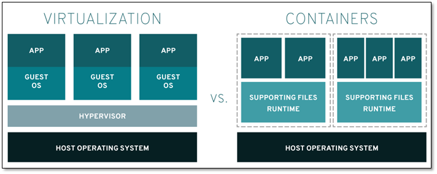
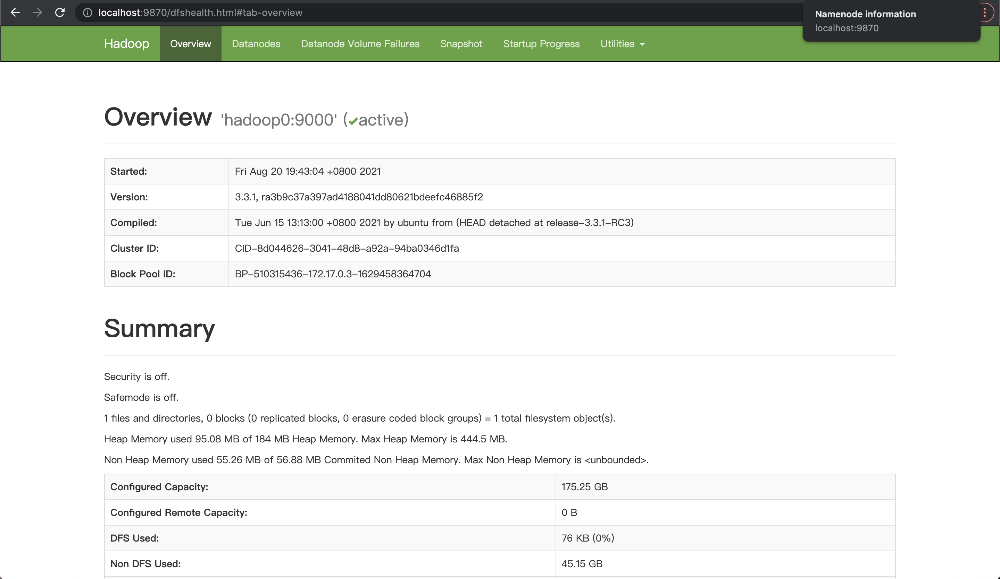
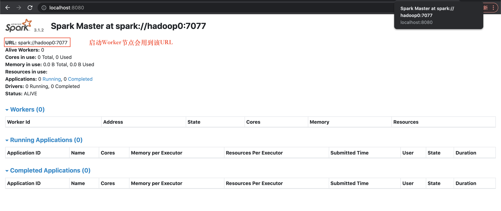
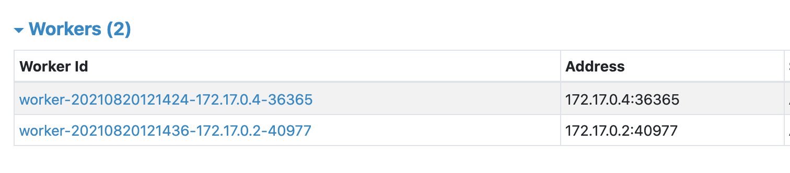
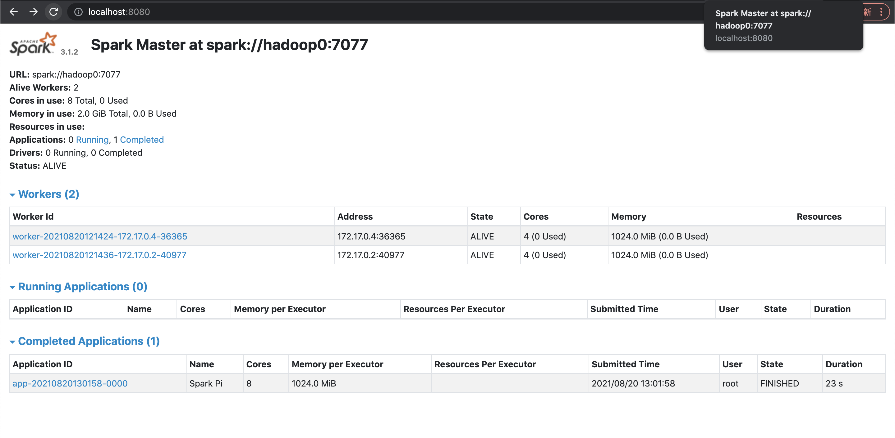

计算机中所有程序都要寄托一个环境运行，环境可以理解为一个程序运行所需要的条件的集合；如果只是为了写一个Java程序，它是单进程的，那么我们配置jdk、jre就可以了；如果写一个网站，有前后端、数据库服务、缓存服务等等，它们都要跑在不同的端口乃至不同的服务器上，配置环境让他们可以协同运作就会变得稍微复杂一些了；本篇文章将会介绍一个同样复杂的环境配置 —— Spark + Hadoop。

由于 Spark和Hadoop通常都运行于**分布式环境**，有主从节点，因此一般在Linux服务器集群进行分布式生产环境部署，但很多人在学习时可能是没有多台服务器可以练手的，这时通常会选择用虚拟化的技术实现分布式，这里的选择就包括了**虚拟机**和**Docker**。


### Docker vs 虚拟机

虚拟机就是用系统镜像去创建，**虚拟出硬件资源**直接跑一个完整的操作系统，虚拟机运行时你的电脑硬件资源被拆分后跑两个操作系统，配置分布式多节点就要跑多个完整的操作系统，想必性能受限；

Docker是一个沙箱环境， 它在宿主机内核的基础上**虚拟出了一个操作系统**，更适合对不同应用的**隔离**，隔离程度没有虚拟机高，不用内核，没那么占据存储空间。



再看看我们的需求，只需要虚拟出多个节点进行Hadoop和Spark的实验，不需要考虑真实的集群生产环境，没必要虚拟完整的操作系统，因此选择用Docker来部署本地的分布式环境。当然，更直观的一个原因是，Docker在内存和存储的消耗比虚拟机小得多，本地实验更友好。


### Docker 镜像

首先拉一个docker的centos7镜像（确保已经装了docker），发现只有200M，和虚拟机上运行的5G镜像差了20多倍，原因前面提及过，操作系统是内核加文件系统，而Docker容器运行使用的是宿主机的内核，因此Docker镜像仅包含了挂载在宿主机内核上的**根文件系统**，叫做**Union FS**，它是适配了Docker分层结构的一个文件系统。Linux中的根文件系统是文件系统特殊的一种，通常在操作系统启动阶段加载到内存中，挂载了根文件系统才能逻辑性的去访问磁盘，才能去使用基本的shell命令，才能去加载一些系统的配置文件。文件系统就是为了硬件能与用户交互产生的，因此我们在开启一个有根文件系统的容器时，也觉得像在使用一个完整的操作系统。

镜像是只读的，容器相当于“实例化”镜像，它记录了对镜像的修改，可以在当前镜像的基础上叠加修改内容构建出一个新的镜像，由于是分层模式，一个镜像应该尽量简洁仅包含当前环境，删除掉一些无关数据；构建一个新镜像常用的两种方法是commit和Dockerfile，commit是基于当前容器构建镜像，构建出来的镜像像一个黑箱，Dockerfile是从头开始根据一行行指令去构建新镜像，逻辑更加清晰。


### 启动容器

```bash
$ docker  # 确认Docker可以正常运行
$ docker pull centos:centos7  # 拉镜像
$ docker image ls  # 查看镜像
```

启动Docker就是启动了一个父进程Docker Daemon，Docker内启动每个容器都是启动Docker Daemon的一个子进程，子进程下有它自己的命名空间。

```bash
$ docker run -it --name linux1 centos /bin/bash
```

启动容器后可以在宿主机命令行执行 docker ps 查看容器运行状态，也可以执行 docker inspect 容器ID 查看容器运行的各种相关数据。

接下来都在容器的bash中执行命令。

---------------------------------------------------------------------------------------------------

首先我们需要安装Hadoop、Spark及相关应用程序到容器中，可以wget下tar包，也可以使用 docker cp 命令将本地tar包拷贝到指定的容器目录下，解压tar包；通常用户程序我们拷贝到 /opt 中，另外还要注意彼此的版本依赖。当然，也可以在我们本地解压好直接cp到容器中。

```bash
$ cd /opt
$ yum install wget
$ wget https://downloads.lightbend.com/scala/2.12.14/scala-2.12.14.tgz
$ wget Hadoop下载地址
$ wget Spark下载地址
$ wget https://repo.huaweicloud.com/java/jdk/8u201-b09/jdk-8u201-linux-x64.tar.gz
$ ls
hadoop-3.3.1.tar.gz  jdk1.8.0_201.tar.gz	scala-2.12.14.tgz	spark-3.1.2-bin-hadoop3.2.tgz

$ tar -zxvf hadoop-3.3.1.tar.gz
$ tar -zxvf scala-2.12.14.tgz
$ tar -zxvf spark-3.1.2-bin-hadoop3.2.tgz
$ tar -zxvf

$ ls
hadoop-3.3.1  jdk1.8.0_201  scala-2.12.14  spark-3.1.2-bin-hadoop3.2
```


### 配置Java, Scala环境变量

```Bash
$ vi /etc/profile

// Java
JAVA_HOME=/opt/jdk1.8.0_201/ 
JAVA_BIN=${JAVA_HOME}/bin 
JRE_HOME=${JAVA_HOME}/jre CLASSPATH=${JRE_HOME}/lib:${JAVA_HOME}/lib:${JRE_HOME}/lib/charsets.jar 
export  JAVA_HOME  JAVA_BIN JRE_HOME  PATH  CLASSPATH
// Scala 
export SCALA_HOME=/opt/scala-2.12.12 
export PATH=$PATH:$SCALA_HOME/bin

$ source /etc/profile

$ vi ~/.bashrc

export JAVA_HOME=/opt/jdk1.8.0_201 
export PATH=$JAVA_HOME/bin:$PATH 
export CLASSPATH=.:$JAVA_HOME/lib/dt.jar:$JAVA_HOME/lib/tools.jar

$ source ~/.bashrc
$ Java -version
$ scala -version
```


### 配置Hadoop

```bash
$ cd /opt/hadoop-3.3.1
$ vi etc/hadoop/hadoop-env.sh
```

末尾添加jdk目录

```bash
export JAVA_HOME=/opt/jdk1.8.0_201
```

配置Hadoop环境变量

```bash
$ vi ~/.bashrc

export HADOOP_HOME=/opt/hadoop-3.3.1
export PATH=$PATH:${JAVA_HOME}/bin:${HADOOP_HOME}/bin:${HADOOP_HOME}/sbin

$ hadoop version # 验证环境变量生效
```


### 安装SSH

```Bash
$ yum install openssh-clients
$ yum install openssh-server
```


### 配置免密登陆

```bash
$ cd ~/.ssh
$ ssh-keygen -t rsa
$ cat ~/.ssh/id_rsa.pub >> ~/.ssh/authorized_keys
```

笔者在测试时ssh localhost报错：ssh: connect to host localhost port 22: Cannot assign requested address；判断ssh服务没开启，但用systemctl开启服务时报错：

```Bash
System has not been booted with systemd as init system (PID 1). Can't operate.
Failed to connect to bus: Host is down
```

只能手动去开启，分两步：

（1）生成 host_key  

```bash
$ ssh-keygen -t dsa -f /etc/ssh/ssh_host_dsa_key
$ ssh-keygen -t rsa -f /etc/ssh/ssh_host_rsa_key
$ ssh-keygen -t ecdsa -f /etc/ssh/ssh_host_ecdsa_key -N ""
$ ssh-keygen -t dsa -f /etc/ssh/ssh_host_ed25519_key
```

（2）启动SSH服务

```bash
$ /usr/sbin/sshd -f /etc/ssh/sshd_config
```


### 将当前容器打包成镜像

docker commit -m "centos7 with hadoop and ssh" linux1 centos7-hadoop-ssh


### 开启三个容器

```Bash
$ docker run --name hadoop0 --hostname hadoop0 --privileged=true -P -p  50070:50070 -p 8088:8088 -p 9870:9870 -p  9864:9864 -p 8080:8080 centos7-hadoop-ssh  

$ docker run --name hadoop1 --hostname hadoop1 --privileged=true  centos7-hadoop-ssh  

$ docker run --name hadoop2 --hostname hadoop2 --privileged=true centos7-hadoop-ssh  
```


### host配置主机名和IP地址的映射

```Bash
$ vi /etc/hosts

172.17.0.4      hadoop2
172.17.0.2      hadoop1
172.17.0.3      hadoop0
```

测试过可以互相ping通，且可以互相ssh连接，不难理解为什么，在最开始的容器中，我们已经生成了SSH密钥对，并将公钥放入了authorized_keys中，SSH是通过非对称加密进行的认证，带着公钥进行SSH连接就可以通过认证实现免密登陆，由于我们是先通过容器创建镜像，用同一个镜像又开了三个容器，这样每个容器都有相同的公私钥，自然就可以通过其它容器的认证了。


### 三个容器上配置Hadoop

这里配置内容和Hadoop_env所讲类似，可以参考那篇文章。

另外还需要修改$HADOOP_HOME/etc/hadoop/hadoop-env.sh，添加：

```Bash
export HDFS_NAMENODE_USER=root
export HDFS_DATANODE_USER=root
export HDFS_SECONDARYNAMENODE_USER=root
export YARN_RESOURCEMANAGER_USER=root
export YARN_NODEMANAGER_USER=root
```

在$HADOOP_HOME/etc/hadoop/目录下新建slaves文件，配置DataNode节点，不做此配置DataNode节点无法启动。

```bash
$ vim etc/hadoop/slaves

hadoop1
hadoop2
```

配置完使用scp将配置分发到Hadoop1和hadoop2上

```bash
$ scp  -rq /opt/hadoop-3.3.1   hadoop1:/opt
$ scp  -rq /opt/hadoop-3.3.1   hadoop2:/opt
```

确定之前配置文件中的tmp和namenode、datanode路径都存在，没有则创建；确定可以使用which，没有则yum install -y which。

首次启动集群需要在hadoop0格式化namenode

```bash
$ bin/hdfs namenode -format
```

hadoop0为namenode节点，hadoop1~3均为datanode节点，三个容器中都启动hdfs。

```Bash
$ sbin/start-dfs.sh
```

每个容器内可以使用 jps 确定一下对应的进程是否启动成功。

因为在启动docker的时候做了端口映射，直接localhost:9870就可以访问namenode的web页面：




### 启动Spark

在master节点的对应容器内进入Spark目录，执行：

```Bash
$ ./sbin/start-master.sh
```

在映射的8080端口查看master节点启动成功：



记录下上面的URL，进入Worker节点对应的容器Spark目录下，

```bash
# ./sbin/start-worker.sh <url>
$ ./sbin/start-worker.sh spark://hadoop0:7077
```

启动成功后在之前Master节点的web页面下可以看到



### 测试Spark

运行官方样例 —— 计算Pi

```bash
.bin/spark-submit --class org.apache.spark.examples.SparkPi \
--master spark://hadoop0:7077 \
examples/jars/spark-examples_2.12-3.1.2.jar \
10
```

查看执行情况：




综上，我们的Docker模拟完全分布式Hadoop+Spark集群就已经搭建完毕，并且通过了测试。

之后会一点点进行 Spark 学习的经验分享！